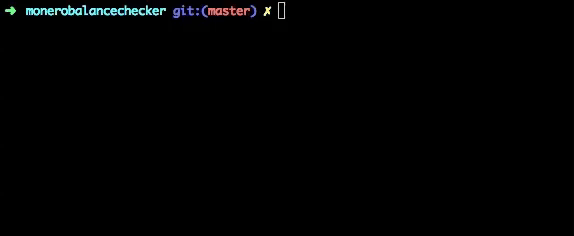

# Monero balance checker


### Usage

1. Clone repository
2. `cd monerobalancechecker/`
3. `bundle`
4. `ruby check_monero.rb`

### Result:
```
$$$$$$$$$$$$$$$$$$$$$$$$$$$$$$

[-] Gathering data ... Done!

Your current Monero balance from moneropool.com is: 0.20227491362
And your current hashrate is 497.00 H

$$$$$$$$$$$$$$$$$$$$$$$$$$$$$$

```
### Example:

